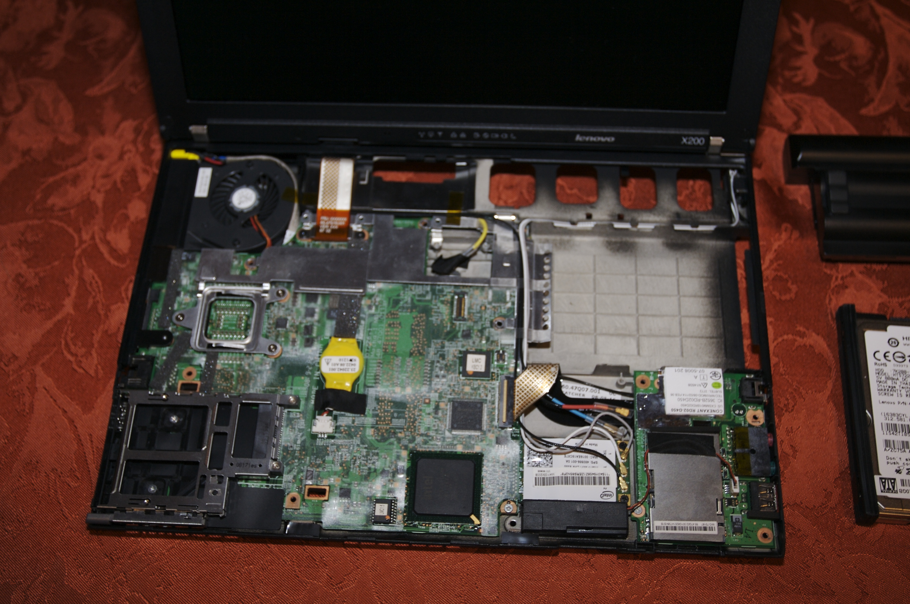

# My internals, or how I found my way to programming

I decided to write my first blog post to describe where I am now in my life in relation to programming. My OpenAI tokens are almost done for this week, and I like to write, so I decided to reach people who got lost while learning programming the hard way during the massive adoption of LLMs, and others who can help me step into this new tech era, and maybe others. Who knows?

I am a 35-year-old French teacher on italki who used to learn how to code with a Lenovo X200 on the metro in my mid-twenties, then stopped everything because I thought LLMs were ruining all my efforts, and finally got back to programming by using agents to build things for my French teaching business. I lost faith in what I was doing because the tech industry was so anxious about LLMs that it infected my own goals.

Now I create my own tools, systems, and agentic workflows, which I use daily. It is kind of weird, but this is my life. I feel like I am not a French teacher anymore because I know how to code. I do not feel like a coder anymore because I use LLMs. So I built a blog, using LLMs, after years of learning how to code, and decades enjoying nerdish cultures. Ironic, but fast, and fun! I think this still makes me a programmer.

_This picture is not my Lenovo X200. Mine went D.E.A.D. a while ago. This X200 might have been owned by [Masaru Kamikura](https://commons.wikimedia.org/wiki/File:ThinkPad_X200_internals.jpg), who took the picture and shared it via [Wikimedia Commons](https://commons.wikimedia.org/)._

## Paris, France, no money, no time to code

So, at first, learning how to program was tough for me. Not intellectually. But because, yes, there is something worse than tutorial hell. Or worse than AI stealing a job I never even reached in tech. There is the metro-work-sleep trap of Paris. After graduating with a non-tech degree, I used to work for OFII, a French government immigration agency. I was helping provide accommodation for people applying for political asylum. So I really did not have much time in the morning, in the evening, or on weekends to learn programming seriously.

But... since I was a kid, I enjoyed having computers in my life (weirdoooo). I built my second computer at the age of 12 by asking my poor mom to buy different components on the Internet. So, as a young adult frustrated with my degree in political science and sociology, it made sense for me to want to learn how to speak the language of computers. I bought a Lenovo X200, set up Arch Linux on it, and carried it with me on the metro. If it got stolen or broken, it would not ruin me. At least I could tweak my distro and learn how to code while studying [Zed A. Shaw](https://en.wikipedia.org/wiki/Zed_Shaw), at a time when I thought he was a good person to learn from.

Anyway, no time + no money beats all the motivation in the world. So I stayed away from my X200 for a while, quit my job, and started working nights in a gay bar called [Rosa Bonheur](https://rosabonheur.fr/), while also getting involved in the organization of social and cultural events in the squatting scene of northeastern Paris, in the 19th arrondissement.

  <iframe
    src="https://www.youtube-nocookie.com/embed/aMBT7x-xo_Y"
    title="Noir Boy George - Enfonce-toi dans la ville"
    loading="lazy"
    referrerpolicy="strict-origin-when-cross-origin"
    allow="accelerometer; autoplay; clipboard-write; encrypted-media; gyroscope; picture-in-picture; web-share"
    allowfullscreen
  ></iframe>

_A French song by [Noir Boy George](https://noirboygeorge.bandcamp.com/) about how big cities are sad._

## Salvador, Brazil, a bridge to real study

> _"As-tu déjà remarqué que les âmes en peine s'attirent ? Dans les zones désaffectées, les zones froides de la ville."_ -- Noir Boy George

It did not take me long to get bored and frustrated with that life. To be fair, I had a lot of fun between that bar and the squatting culture, but being surrounded by people drinking day and night, or people replaying the French Revolution over and over made me feel like I was going nowhere. Then a friend offered me the chance to move to Brazil with him, to Salvador. A new language, a new culture, a new country. Elsewhere felt better than nowhere. We only have one life, right?

There, I started working as a French teacher at the Alliance Française. I was not making good money there either. That organization did not seem ashamed to pay people 1,400 R$, which was less than 200 € for a month of labour. So I started building an online French teaching business after six months on italki, and that gave me much more autonomy. After a while working ~60 hours per week, doing both at the same time, I could reduce the pace and focus on something else. And that "else" was my small business. The guy working in a bar and hanging around the Parisian squatting scene found pleasure in working on his small business.

And once you run your own small business, you need to satisfy your clients. When you also need to reduce the time you spend managing files, folders, archives, publishing content, or studying competitors, what do you need? Automation, scripting, CLIs, APIs, servers, etc. You know what I mean. This is how I got back to programming. It could help me build the things I needed for my business, and that same business was already giving me more time to keep learning.

## Learning more than coding?

During that period, I learned mostly through CS50, Roadmap.sh, The Odin Project, Boot.dev, and +/- random Udemy courses about frameworks I do not even use anymore. I also started building toy projects, small projects, and applying what I learned to my work right away -- which whas the best! At the same time, LLMs like ChatGPT were becoming mainstream, so I started using them too. But I was not using them to code for me. I learned the fundamentals, and then I kept going on wihtout them, but using them for my work. I was already kind of conservative in my relationship with code.

Back in Paris, during the gay bar and squatting scene, I used to spend most of my free time reading literature, but in Brazil, after being done with learning Portuguese, I replaced that free time with technical reading: software architecture, design patterns, testing, app design, or simply pragmatic software work. I reorganized my whole life around reading and practicing. Instead of carrying a heavy workload every day, I cut two or three hours of work from my schedule and accepted working Monday to Sunday so I could create bigger blocks of time to read, code, and learn every day. Plus, I was using LLMs to help me with teaching materials compliant with how I envision my job as a teacher and the CEFR framework.

This is where I started to normalize prototyping in Python and building useful binaries in Go. Meanwhile, AI was getting better...

  <iframe
    src="https://www.youtube.com/embed/FpWdFykMVBk?start=140"
    title="Ghost in the Shell - Puppet Master hacker scene"
    loading="lazy"
    referrerpolicy="strict-origin-when-cross-origin"
    allow="accelerometer; autoplay; clipboard-write; encrypted-media; gyroscope; picture-in-picture; web-share"
    allowfullscreen
  ></iframe>

_A film excerpt from [Ghost in the Shell](https://en.wikipedia.org/wiki/Ghost_in_the_Shell_(1995_film)) by [Mamoru Oshii](https://en.wikipedia.org/wiki/Mamoru_Oshii), where the character Project 2501 explains a few things to humans._

## When AI started to feel like a threat

> "When computers made it possible to externalize memory, you should have considered all the implications that held." -- Project 2501

While all of that was happening, AI kept moving forward. I kept moving too, anyway. There is actually no other option. By the end of 2024, I tried to build a portfolio and use these tools for myself while still doing the work I thought I needed to do to prove to myself that I was good at programming, which was the same as coding to me.

So, listening to senior engineers who are actually working on YouTube claiming that you had to code everything and maintain your skills, I seriously turned off my LSPs in my editors to get better. But, huh? Who cares about your little project portfolio written without an LSP when an LLM can read a stupid `.md` file, and build something better and faster than you?

I was hoping I might find a job one day, or maybe move into freelance. Who knows? Then things got darker. I was reading and watching content from anxious people on social media, or from content creators manipulating that anxiety to increase their social media metrics. Coders were supposedly about to be replaced by LLMs, and I started to feel that I had no real future. I thought French teachers would be replaced too, and maybe... all humankind?

That hit hard. Why? Because I had spent around three years sacrificing my social life to learn seriously something that I really enjoyed, but you know, even if the way is what matters, not the destination, blablabla..., I'm not a monk. I still need to make money, because the journey does not pay the bills, and as my brother says: "You buy the life you want."

And I had spent around two years building a business that would give me the conditions to study for three years, only to see those things suddenly look out of date. Yeah! It felt like an old dream from my twenties was collapsing in the middle of my life. But, well. I am not the first human being to go through that.

I kept building useful tools for myself as a teacher. I did not reject LLMs, even if we all know `skynet-6.6.6` auto-degenerated version will ditch the bootstrap human floppy image from Earth, just like my MacBook Pro M1 made my X200 vanish in my heart.

I tried to integrate them quickly because I could already see how much it helped me reduce friction in my pedagogical work. But by the beginning of 2025, I had become deeply discouraged. I hit a wall. If people who were already well established in the tech industry could lose their jobs, how was I supposed to enter that world? There was no "world" for them anymore. I had made a very bad investment, and the dream I had carried for years had turned into a total failure, just when I had built the conditions to pursue it seriously.

At that point, I basically stopped. I had lost my motivation. On top of that, there was a lot of criticism around LLM-generated code, vibe coding, and the idea that all of this was degrading the industry, and people were claiming a lot of shit about how great vibe coding was at the time, while it was still bad. Let's be honest. So, I stopped for few months.

## Stopping, then reframing the problem

In the second half of 2025, something changed. I came out of my self-instilled negativity, with no mental space for programming at all. Whatever the market was doing, I still needed to move forward in my own life. As a teacher, that path felt safer, because I was already well established in my market, and my small business was not collapsing, at least according to my own prompt-engineered deep research on Anthropic's web app.

I had to bet on what I had learned over the previous years and use my skills not only as someone who can write code, but as someone who can program. And I decided to create products for French exams, and I am actually still developing other things. But anyway, what became clear in my head is that I do not need Latin to speak English or teach French. But if I know it, I am gonna be better at it! Same thing with coding and programming. If you know coding, you might be better at programming, but it is not the core anymore.

At the same time, I started to come out of both the anti-vibe-coding mindset and my own devaluation of my skills due to the massive adoption of LLMs. I also came across people like [Mitchell Hashimoto](https://mitchellh.com/writing), [Armin Ronacher](https://lucumr.pocoo.org/), [Simon Willinson](https://simonwillison.net/), and [Peter Steinberger](https://steipete.me/), whose writing gave me a very different view of what it means to work with these new tools. I am really thankful to them. They were not treating LLMs as magic, and they were not rejecting them either. They were using them in ways that changed how programming work could be organized.

It unlocked something for me. Neither vibe coder nor anti-LLM, I was starting to have fun solving problems again, but in a different way, using my knowledge of system design, data flow, and architecture, which I had learned by reading all those books, to produce good deliverables, make my life easier, and keep my clients happy. More and more, the real question turned into how to deal with agentic workflows, and the new kind of cognitive load I would need to handle while dealing with them, how to experiment with them. Programming was exciting again.

## What programming means to me now

> "Escolhem com carinho a hora e o tempo 
> Do seu precioso trabalho 
> São pacientes, assíduos e perseverantes" -- Jorge Ben Jor

Those LLMs can help me produce teaching materials of very high quality, with a level of personalization that would have been much harder before. With agentic workflows and harness, I built the equivalent of my own small publishing house, audio team, and engineering staff. I now have tools that generate high-quality audio under strict constraints, edit it automatically with FFmpeg, and coordinate interoperable agents across the whole chain, from implementation to distribution and scale. They also help me build better codebases for the tools I need in my own work, or in my day-to-day life.

Today, I do not feel that I need to chase the stability of a job in a company. Maybe later. Part of that is because the competition is intense. But another part is that I now feel more freedom. Because of this tech shift, I can imagine products and services that I would not have been able to create alone before. This is what I want to bet on now: building useful things, enjoying the process more, and using what I learned not as wasted effort, but as the foundation that now lets me build things I could not have built on my own before, because I did not have the capital to hire engineers to do the job for me. That's pretty much it: going from an X200 to shipping fast code with current LLMs, or the next models. That decade got crazy. And it's going to continue!

The next step for me is to get involved in the programming community, talk to and meet people like me who are enthusiastic about using those new tools, distribute more open source software, and build my own products. This is really the goal of my site here. I think I will continue my way with LLMs, or whatever next kind of AI comes. Once the wheel appeared for humans, it was probably unlikely that we would stop using it any time soon. See you around!

  <iframe
    src="https://www.youtube.com/embed/XwvU-SRb5_A?si=-Ru3NDsi9HGHg9Ys"
    title="Los Sebozos Postizos - Os Alquimistas Estão Chegando"
    loading="lazy"
    referrerpolicy="strict-origin-when-cross-origin"
    allow="accelerometer; autoplay; clipboard-write; encrypted-media; gyroscope; picture-in-picture; web-share"
    allowfullscreen
  ></iframe>

_[Los Sebosos Postizos](https://open.spotify.com/intl-fr/artist/6J3woQCTe8Tk7APW7vjy4H) covering "[Os Alquimistas Estão Chegando](https://open.spotify.com/intl-fr/track/6WohVJvZ6RYmYN8Nxl9VHa?si=193e3bf3ed9e41f2)" written by [Jorge Ben Jor](https://pt.wikipedia.org/wiki/Jorge_Ben_Jor)._
